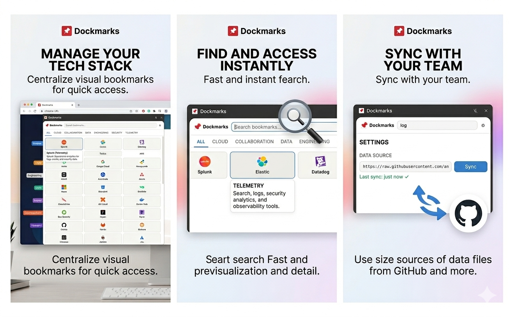

# Dockmarks

<p align="center">
  
</p>

Stop digging through browser bookmarks or Slack threads trying to find that one link. Dockmarks puts your team's bookmarks right in Chrome's side panel — always one click away, on any tab.

Point it to a JSON URL your team maintains and everyone gets the same organized set of links, grouped by category and always up to date.

## Features

- Opens as a side panel — browse links without leaving your current tab
- Loads bookmarks from any JSON URL (GitHub, S3, your own server — you choose)
- Organizes links into sections like Engineering, Cloud, Security, or whatever your team needs
- Search by name, description, or tags — find what you need in seconds
- Remembers what you use most and puts those links first
- Syncs automatically every hour in the background

## How it works

1. Install Dockmarks
2. Click the icon to open the side panel
3. Tap the gear icon, paste your JSON URL, and hit Sync
4. That's it — your bookmarks are ready

One JSON file, maintained by your team. Everyone installs Dockmarks, points to the same URL, and sees the same links.

## Try it now

Paste this example URL in Settings to see it in action with 50+ sample bookmarks across six categories:

```
https://raw.githubusercontent.com/Andresnator/dockmarks/main/bookmarks.example.json
```

## Bookmark JSON format

Host a JSON file at any URL with this structure:

```json
[
  {
    "id": "jira",
    "name": "Jira",
    "url": "https://yourcompany.atlassian.net",
    "section": "TOOLS",
    "description": "Issue tracker",
    "tags": ["issues", "sprints", "agile"]
  }
]
```

| Field | Type | Required | Description |
|-------|------|----------|-------------|
| `id` | string | Yes | Unique identifier |
| `name` | string | Yes | Display name |
| `url` | string | Yes | Link URL |
| `section` | string | Yes | Tab/category name (e.g. `ENGINEERING`, `CLOUD`) |
| `description` | string | No | Shown as subtitle in the card |
| `tags` | string[] | No | Extra keywords for search |

## Development

```bash
npm install
npm run build      # production build → dist/
npm run dev        # watch mode
npm test           # run tests
npm run typecheck  # TypeScript check
```

### Load in Chrome

1. Run `npm run build`
2. Go to `chrome://extensions/`
3. Enable **Developer mode**
4. Click **Load unpacked** → select the `dist/` folder

## Stack

- TypeScript + Vite (multi-entry build)
- Chrome MV3 (Side Panel API, Storage API, Alarms API)
- Vitest for unit tests
- No framework — vanilla DOM components

## Privacy

No analytics. No tracking. No data collection. Dockmarks only connects to the JSON URL you configure. Everything stays in your browser.

See the full [Privacy Policy](PRIVACY.md).

## License

[MIT](LICENSE)
